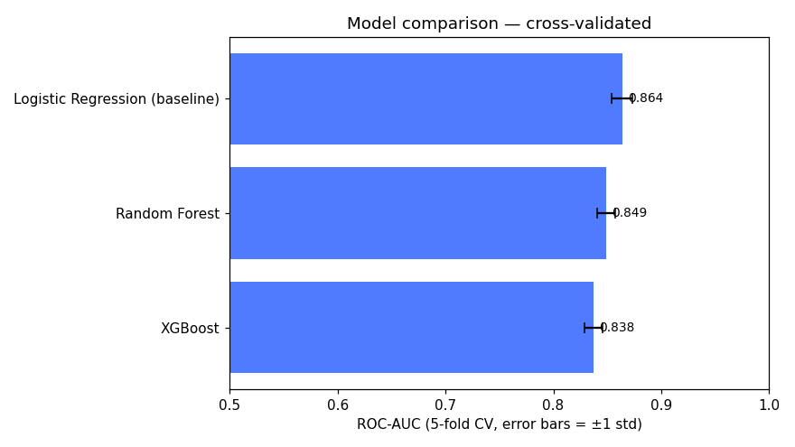

# Credit Risk MLOps Pipeline

An end-to-end, production-style machine learning system for **loan-default
prediction** — built to demonstrate the full ML lifecycle, not just a notebook
model. A borrower's application goes in; a calibrated default probability, risk
band, and decision come out, served over an API, tracked with MLflow, tested in
CI, and monitored for drift.

> Domain note: the schema mirrors a vehicle/consumer loan book. Swap the
> synthetic data generator for a real source (Home Credit Default Risk,
> LendingClub, or an internal loan book) to make it live.



*Verified project artifact: cross-validated ROC-AUC comparison across the baseline and tree models.*

## Why this project

Most portfolios stop at `model.fit()`. This one shows the parts production teams
actually care about:

| Concern | How it's handled |
|---|---|
| Modelling | XGBoost (HistGradientBoosting fallback), class-imbalance handling, ROC-AUC / PR-AUC / calibration |
| Reproducibility | Config-driven pipeline, fixed seeds, deterministic data generation |
| Experiment tracking | MLflow — params, metrics, and versioned models in the registry |
| Serving | FastAPI + Pydantic validation, Dockerised |
| CI/CD | GitHub Actions — data → train → test on every push |
| Monitoring | Evidently drift reports (PSI fallback) with a retrain trigger |

## Architecture

```
                    ┌──────────────┐
  raw loan data ──► │ preprocessing│──► XGBoost ──► model.joblib
                    │  (sklearn)   │        │
                    └──────────────┘        ▼
                                       MLflow registry
                                            │
  loan application ──► FastAPI /predict ────┘──► {probability, risk_band, decision}

  live data ──► Evidently drift check ──► drift? ──► trigger retrain
```

## Quickstart

```bash
pip install -r requirements.txt

make data      # generate the synthetic dataset
make train     # train, evaluate, log to MLflow, save model
make serve     # start the API at http://localhost:8000/docs
make test      # run the test suite
make drift     # simulate a new batch and run drift detection
```

Or the whole stack in Docker:

```bash
make docker    # API on :8000, MLflow UI on :5000
```

## Example request

```bash
curl -X POST http://localhost:8000/predict -H "Content-Type: application/json" -d '{
  "age": 34, "annual_income": 55000, "loan_amount": 240000,
  "loan_term_months": 60, "employment_years": 4, "credit_score": 680,
  "num_existing_loans": 2, "debt_to_income": 0.42, "past_defaults": 0,
  "home_ownership": "RENT", "loan_purpose": "vehicle"
}'
# -> {"default_probability": 0.31, "risk_band": "MEDIUM", "decision": "REVIEW"}
```

## Project layout

```
data/generate_data.py   synthetic dataset (reproducible, offline)
src/config.py           single source of truth for paths, features, params
src/pipeline.py         preprocessing + model pipeline
src/train.py            train + evaluate + MLflow logging + persist
src/monitor.py          drift detection + retrain trigger
app/main.py             FastAPI serving layer
tests/                  pipeline + API tests (run in CI)
.github/workflows/ci.yml  GitHub Actions pipeline
Dockerfile / docker-compose.yml
```

## Roadmap (extend over 2 weeks)

- Week 1: real dataset, EDA notebook, hyperparameter tuning, SHAP explainability
- Week 2: deploy to Render/HF Spaces, add a monitoring dashboard, scheduled
  drift job that opens a retrain PR automatically

## Metrics (current synthetic run)

ROC-AUC ≈ 0.86 · PR-AUC ≈ 0.75 on held-out test — realistic for credit risk,
where the positive (default) class is rare and hard.
